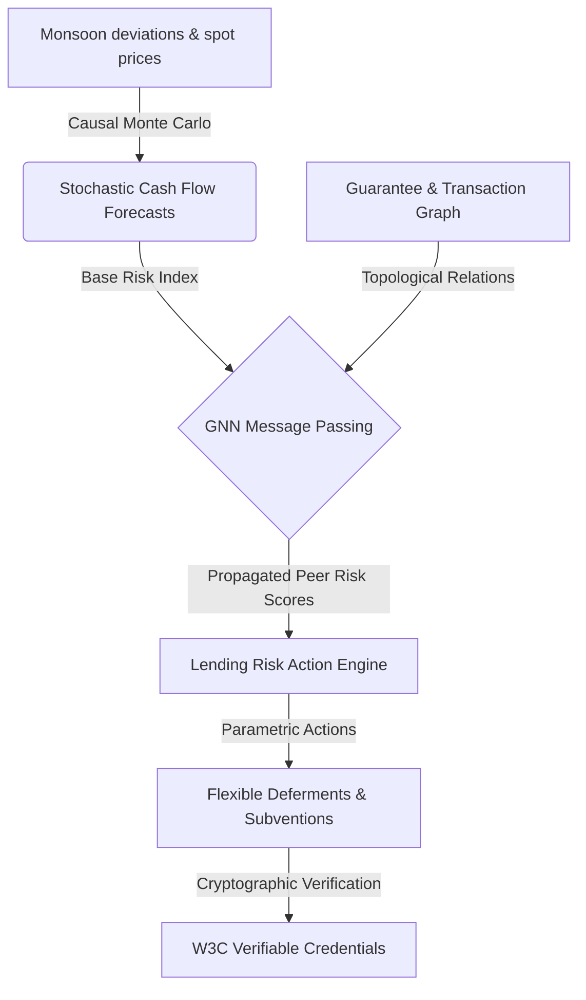

# Topological Peer-Risk Propagation Matrix (TPR-MATRIX) & Decentralized Causal Inference Platform

[](LICENSE)

TPR-MATRIX is a high-fidelity risk-analytics platform designed to model credit default cascades, systemic climate deviation shocks, and transaction anomalies in rural credit clusters. Using **Graph Neural Networks (GNNs)**, **Stochastic Causal Modeling**, **Differential Privacy (DP) Federated Learning**, and **Cryptographic Audit Ledgers**, it equips policy lenders and credit associations with real-time systemic risk intelligence.

---

## 🔬 Core System Architecture



### 1. Topological GNN Peer-Risk Propagation
The system models borrowers as nodes in a heterogeneous graph connected by cross-guarantees, group membership (SHGs/FPOs), and transaction records. 
- **Message Passing Strategy**: An iterative peer-risk propagation algorithm aggregates neighbor risk vectors.
- **Cascading Distress**: Risk is defined dynamically as a function of the borrower's intrinsic base risk (e.g. crop yield projections) plus joint liability guarantee distress factors.
- **Anomaly communautaire**: Community cycles are audited via cycle-detection algorithms to isolate closed transaction loops (mule rings) attempting to fabricate credit history.

### 2. Explainable Causal Sandbox
- **Parametric Monte Carlo Shocks**: Simulates climate deviations (monsoon sowing delay, precipitation drops) and wholesale commodity price indices.
- **Stress Curve Sweeps**: Generates dynamic risk bounds across key variables, identifying exact thresholds where cash reserves drop below repayment obligations.

### 3. Decoupled Compliance Screening (AML/PEP)
- **Layering & Structuring Scans**: Checks transactions for anomalous credit-debit volumes, transaction loop speeds, and rapid pass-through signs.
- **PEP & Sanctions Matching**: Screens entities against decoupled watchlists, instantly feeding compliance alerts back into the peer graph.

### 4. Differentially Private Federated Learning
- **Privacy-Preserving Training**: Coordinates local model updates across regional banks without centralizing sensitive transactional records.
- **Privacy Budgeting**: Tracks privacy decay using Differential Privacy ($\epsilon$-Epsilon expenditure) to ensure compliance with strict security thresholds.

### 5. Cryptographic Trust Auditing
- **Verifiable Credentials (VCs)**: Formulates W3C compliant credentials containing verified stability indices, signed via HMAC-SHA256 assertion proofs.
- **Tamper-Proof Audit Trail**: Records system events in a cryptographically chained ledger where each block contains the hash of the preceding record, ensuring complete verification audits.

---

## 📁 Repository Structure

```text
TPR-MATRIX/
├── backend/
│   ├── services/
│   │   ├── action_engine.py       # Interventions & pricing logic
│   │   ├── compliance.py          # AML structuring and PEP checks
│   │   ├── credential.py          # W3C credential issuance and validation
│   │   ├── federated_learning.py  # DP federated models and epilson budget
│   │   ├── forecasting.py         # Monte Carlo causal stress simulations
│   │   └── network_graph.py       # GNN peer-risk message passing
│   ├── database.py                # Database connection & audit logger
│   ├── main.py                    # FastAPI server routers
│   └── requirements.txt           # Python dependency specifications
├── frontend/
│   ├── src/
│   │   ├── assets/                # Statics & media resources
│   │   ├── components/
│   │   │   ├── CausalGraph.tsx    # Causal dependency visualizer
│   │   │   ├── ForecastChart.tsx  # Probabilistic cash flow chart
│   │   │   ├── MobileSimulator.tsx# Portable simulation device wrapper
│   │   │   └── NetworkGraphView.tsx# GNN Node/Edge guarantee visualizer
│   │   ├── App.tsx                # Main portal view and state
│   │   └── index.css              # Glassmorphic Dark UI design system
│   ├── package.json               # Frontend metadata
│   └── vite.config.ts             # Vite build options
├── LICENSE                        # Open-source MIT License terms
└── README.md                      # General system guidebook (This file)
```

---

## 🚀 Setup & Execution Guide

### Prerequisite Environment
- Python 3.10+
- Node.js v18+ & npm

### 1. Initialize Backend Node
Navigate to the backend directory and set up the service server:
```bash
cd backend
# Install dependencies
pip install -r requirements.txt

# Start the FastAPI engine
python main.py
```
*The server will initialize an SQLite database (`system.db`) populated with default cluster profiles and start on `http://127.0.0.1:8000`.*

### 2. Initialize Frontend Portal
Open a new terminal session, navigate to the frontend directory, and run the development compiler:
```bash
cd frontend
# Install dependencies
npm install

# Start Vite hot-reload server
npm run dev
```
*Open `http://localhost:5173/` in your browser to view the glassmorphic risk dashboard.*

---

## 🔒 Security Configuration Notes
- **Credential Signatures**: Simulated signing keys are configured inside the credentials controller for sandbox purposes. Production deployment requires linking to a Hardware Security Module (HSM) or Key Management Service (KMS).
- **SQLite Database**: The local SQLite database (`backend/system.db`) is ignored from version control by default.

---

## 📄 License
This project is licensed under the terms of the [MIT License](LICENSE).
